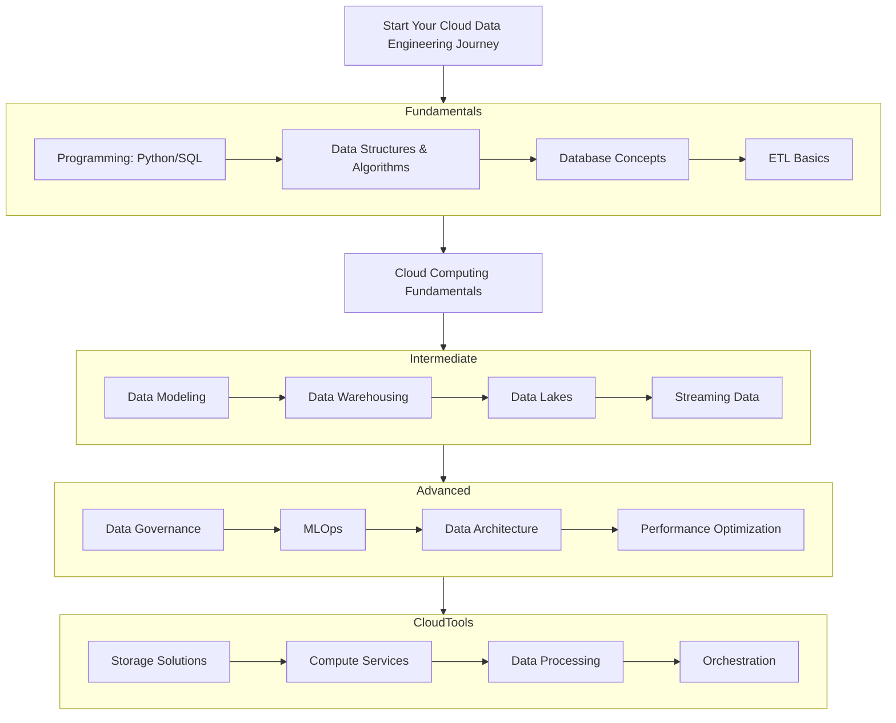

# Report output sample

# Your personalized crash course for `Junior Data Engineer` role at `XYZ Corp`

## Introduction (Summary of Provided Job description)

As a Junior Data Engineer in 2025, you're expected to be familiar with several essential tools:

Programming Languages: Python, SQL, and potentially Java or Scala

Database Systems: PostgreSQL, MySQL, and NoSQL databases like MongoDB

Data Orchestration: Tools like Prefect or Apache Airflow for workflow automation

ETL Tools: Solutions like Apache NiFi or Fivetran

Data Transformation: dbt (data build tool) for transforming data in warehouses

Containerization: Docker for creating consistent development environments

Version Control: Git for code management and collaboration

Big Data Technologies: Apache Spark for processing large datasets

Required Skills
To succeed as a Junior Data Engineer, you should develop these key skills:

Programming: Strong coding abilities in Python and SQL are fundamental

Database Knowledge: Understanding of both relational and NoSQL databases

Data Modeling: Ability to design efficient data schemas and understand data relationships

ETL Processes: Knowledge of how to extract, transform, and load data

Operating Systems: Familiarity with Linux/Unix commands and environments

Critical Thinking: Skills to evaluate issues and develop effective solutions

Communication: Ability to collaborate with both technical and non-technical team members

##

## Recommended Roadmap (Uses Web Search API)



## Fundamentals (Parallel Processed, Using Web Search Agent)

- [Programming Languages]() Covers 10% of Job responsibility
- [DSA]() Covers 8% of Job Responsiblity
- [ETL Course by MIT]()

## Intermediate (Parallel Processed, using Web Search)

- [Data Modelling course by MIT]()

...

## Current Developments (Parallel Processed)

- Archive paper on [Agentic AI]()
- Archive paper on [Advances in Data Engineering Methods]()

## Test your knowledge (RAG agent loaded with Interview Guides (Grokking the Tech Interview, etc))

```
What does API stand for:

A. Application Protocol Interface
B. Application Programming Interface
C. Automated Program Interface
D. Application Process Integration

Solution:The correct answer is (B) Application Programming Interface. An API is a set of definitions and protocols that enables two software components to communicate with each other. It acts as an intermediary that allows applications to talk to each other, exchange data, and share functionality
```

...
