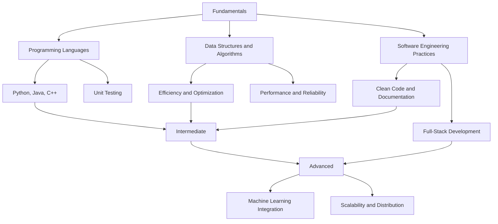
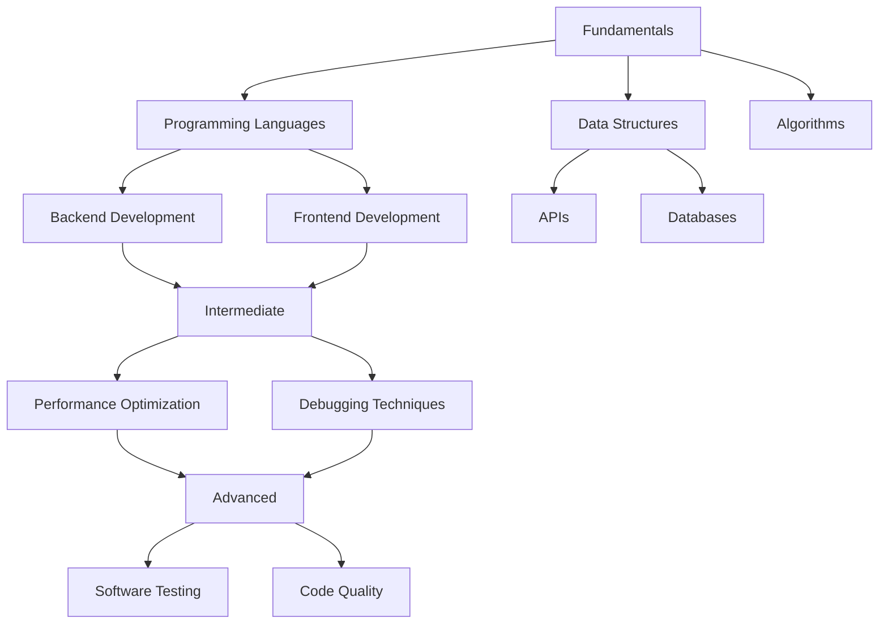
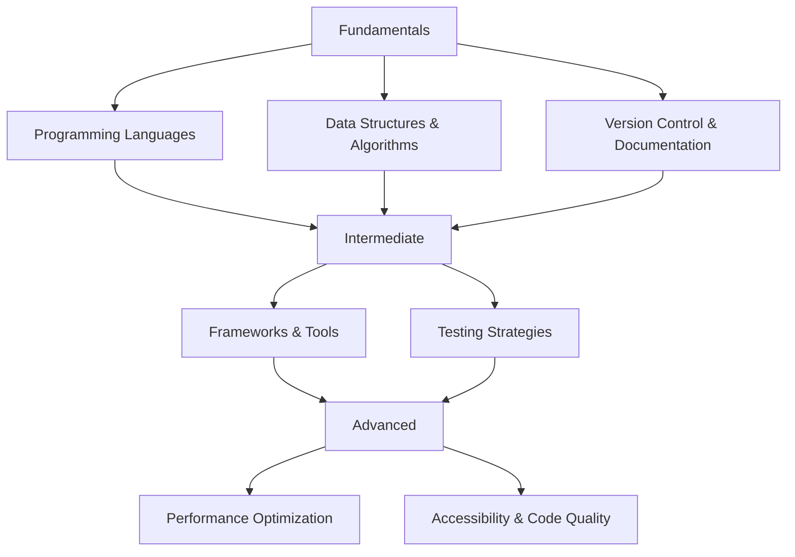

# IntelliPrep - Personalized Interview Crash Course Agent

An AI-powered application that generates personalized crash courses for various tech roles. This application uses LangGraph and LangChain to process user queries about specific job roles and creates detailed career roadmaps and learning resources.

## Features

- Generate comprehensive career crash courses based on job role input
- Create detailed learning roadmaps with Mermaid diagrams
- Recommend specific courses and learning resources
- Provide knowledge tests

## Deployed application

- Backend: [https://nevchris242-interviewprep-agent.hf.space](https://nevchris242-interviewprep-agent.hf.space)
- Frontend: [https://intelli-prep.streamlit.app/](https://intelli-prep.streamlit.app/)

## Architecture

```mermaid
---
config:
  flowchart:
    curve: linear
  theme: mc
  look: classic
---
flowchart TD
 subgraph generate_sections["generate_sections"]
        generate_sections_section_generate_query("section_generate_query")
        generate_sections_search_web_rag("search_web_rag")
        generate_sections_write_and_grade_section("write_and_grade_section")
        generate_sections___end__("<p>__end__</p>")
  end
 subgraph Langgraph["Langgraph"]
        generate_sections
        planning_node("planning_node")
        __start__(["<p>__start__</p>"])
        __end__(["<p>__end__</p>"])
        compile_final_report("compile_final_report")
        collect_sections("collect_sections")
        map_section_generation("map_section_generation")
        write_roadmap_conclusion("write_roadmap_conclusion")
  end
 subgraph s1["FastApi"]
        n1["chat"]
  end
 subgraph s2["Streamlit"]
        n2["user_message"]
  end
    __start__ --> planning_node
    compile_final_report --> __end__
    generate_sections___end__ --> collect_sections
    planning_node --> map_section_generation
    write_roadmap_conclusion --> compile_final_report
    collect_sections -.-> write_roadmap_conclusion
    map_section_generation -.-> generate_sections_section_generate_query
    generate_sections_search_web_rag --> generate_sections_write_and_grade_section
    generate_sections_section_generate_query --> generate_sections_search_web_rag
    generate_sections_write_and_grade_section -.-> generate_sections___end__ & generate_sections_search_web_rag
    n1 <--> __start__
    n2 <--> n1
     generate_sections_section_generate_query:::Aqua
     generate_sections_section_generate_query:::Ash
     generate_sections_section_generate_query:::Peach
     generate_sections_search_web_rag:::Aqua
     generate_sections_search_web_rag:::Ash
     generate_sections_search_web_rag:::Peach
     generate_sections_write_and_grade_section:::Aqua
     generate_sections_write_and_grade_section:::Ash
     generate_sections_write_and_grade_section:::Peach
     generate_sections___end__:::Aqua
     generate_sections___end__:::Ash
     generate_sections___end__:::Peach
     generate_sections:::Aqua
     generate_sections:::Ash
     generate_sections:::Ash
     generate_sections:::Peach
     generate_sections:::Peach
     planning_node:::Aqua
     planning_node:::Ash
     planning_node:::Peach
     __start__:::first
     __start__:::Aqua
     __start__:::Ash
     __start__:::Peach
     __end__:::Aqua
     __end__:::Ash
     __end__:::Peach
     compile_final_report:::Aqua
     compile_final_report:::Ash
     compile_final_report:::Peach
     collect_sections:::Aqua
     collect_sections:::Ash
     collect_sections:::Peach
     map_section_generation:::Aqua
     map_section_generation:::Ash
     map_section_generation:::Peach
     write_roadmap_conclusion:::Aqua
     write_roadmap_conclusion:::Ash
     write_roadmap_conclusion:::Peach
     n1:::Aqua
     n1:::Ash
     n1:::Peach
     n2:::Aqua
     n2:::Ash
     n2:::Peach
    classDef default fill:#f2f0ff,line-height:1.2
    classDef first fill-opacity:0
    classDef last fill:#bfb6fc
    classDef Aqua stroke-width:1px, stroke-dasharray:none, stroke:#46EDC8, fill:#DEFFF8, color:#378E7A
    classDef Ash stroke-width:1px, stroke-dasharray:none, stroke:#999999, fill:#EEEEEE, color:#000000
    classDef Peach stroke-width:1px, stroke-dasharray:none, stroke:#FBB35A, fill:#FFEFDB, color:#8F632D
```



The application consists of:

- A FastAPI backend that processes requests and manages the LangGraph agent
- A Streamlit frontend for user interaction
- A LangGraph-based agent that:
  - Processes user job role queries
  - Searches for relevant information
  - Generates comprehensive career roadmaps
  - Creates personalized learning plans
  - Outputs detailed markdown reports

## Prerequisites

- Python 3.9+
- Poetry (for dependency management)
- API keys for:
  - OpenAI or Gemini (LLM)
  - Tavily (web search)
  - Pinecone (vector database)
  - LangSmith (optional, for tracing)

## Installation

1. Clone the repository:

   ```bash
   git clone [repository-url]
   cd [repository-directory]
   ```

2. Install dependencies using Poetry:

   ```bash
   poetry install
   ```

3. Create a `.env` file based on the provided `.env.example`:

   ```bash
   cp .env.example .env
   ```

4. Fill in your API keys in the `.env` file.

## Running the Application

### Backend Server

Start the FastAPI backend:

```bash
uvicorn backend.app:app --reload --loop asyncio
```

### Frontend Interface

Start the Streamlit UI:

```bash
streamlit run frontend/app.py
```

## Usage

1. Navigate to the Streamlit UI in your web browser
2. Enter a job role you're interested in (e.g., "Junior Data Engineer")
3. Provide the full job description
4. Click "Send" to generate your personalized crash course
5. View the detailed report with learning roadmap, resources, and knowledge tests

## Development

### Project Structure

- `backend/`: FastAPI server implementation
- `frontend/`: Streamlit UI implementation
- `src/agent/`: LangGraph agent implementation
  - `graph.py`: Main agent workflow definition
  - `prompts.py`: LLM prompts used in the application
  - `state.py`: State management for the agent
  - `utils.py`: Utility functions

# Example Output

# Software Engineer - Google

This report provides a comprehensive overview of the essential qualifications and skills required for software engineering positions at Google, particularly focusing on the roles within Google Ads. With a blend of technical knowledge in programming languages, data structures, and system design, along with an emphasis on accessible technologies and code quality, candidates are expected to demonstrate versatility and adaptability. The document articulates the expectations for both foundational and advanced skills that will equip potential engineers to thrive in a dynamic and fast-paced environment, ultimately contributing to innovative solutions that impact billions of users.



## Conclusion

The integration of various skills and knowledge domains is essential for prospective software engineers at Google. Key insights include:

- **Minimum Qualifications**:

  - Bachelor's degree or equivalent experience.
  - Proficiency in multiple programming languages and experience with data structures and algorithms.

- **Preferred Qualifications**:
  - Advanced degrees enhance competitiveness.
  - A strong background in system diagnostics, accessible technology, and performance optimization is highly regarded.

Next steps involve engaging with training resources and practical projects to deepen understanding in areas like full-stack development and data analytics, ensuring alignment with Google's dynamic technological landscape.

# Full Stack Development Preparation Roadmap

The journey to becoming a proficient full-stack developer at a prestigious organization like Google involves a progressive learning approach. This report outlines the essential skills and knowledge necessary for mastering both front-end and back-end technologies. By following a structured roadmap divided into three key stages—Fundamentals, Intermediate, and Advanced—aspiring developers can systematically build their abilities. Each stage includes critical concepts and practices vital to successful software engineering and prepares candidates to excel in the dynamic tech landscape.



## Conclusion

In summary, the pathway to becoming a proficient full-stack developer at Google requires a well-rounded skill set encompassing programming, data structures, algorithms, and development practices. Candidates should focus on mastering key areas throughout three stages of preparation:

- **Fundamentals:** Building strong foundational skills in programming languages, data structures, and algorithms.
- **Intermediate:** Developing proficiency in performance optimization and debugging techniques.
- **Advanced:** Emphasizing software testing and maintaining high code quality.

Moving forward, candidates are encouraged to leverage various online resources and hands-on projects to solidify their understanding and demonstrate their capabilities. Engaging in a continuous learning process will be crucial in adapting to the fast-paced nature of the tech industry.

## Technical Skills and Tools Overview

In the competitive landscape of software engineering at Google, mastering various technical skills is essential. This section highlights the critical programming languages, data structures, algorithms, and development practices that are vital for creating robust applications.

### Programming Languages

At Google, a strong proficiency in programming languages like Python, Java, C++, and Go is imperative. Python plays a pivotal role, especially in machine learning and data science, due to its simplicity and extensive library support for tasks such as real-time model deployment ([1]https://www.restack.io/p/google-software-engineer-answer-programming-languages). Java continues to be a cornerstone for enterprise applications, valued for its security and performance, making it ideal for mission-critical systems. C++ is frequently used where performance is crucial, such as in gaming or simulations. Go is increasingly being adopted for backend services, primarily due to its efficiency in handling concurrent tasks and microservices architecture ([2]https://content.techgig.com/career-advice/top-programming-languages-that-can-help-you-get-a-job-at-google/articleshow/95874137.cms).

### Data Structures and Algorithms

A solid understanding of data structures and algorithms is fundamental for any software engineering role. This knowledge enables engineers to optimize performance and resource allocation in their applications. Both academic settings and practical experiences count, with a focus on efficient data handling and algorithmic thinking. Engineers at Google are not only expected to understand these concepts but also to implement them effectively in real-world applications.

### Full-Stack vs. Backend Development

Understanding the distinction between full-stack and backend development is crucial. Full-stack developers are well-versed in both the front-end and back-end components of a web application. They utilize technologies like HTML, CSS, and JavaScript for the front end while also managing back-end systems with languages like Java or Python ([3]https://www.hackerrank.com/blog/front-end-back-end-full-stack/). This breadth of skills enables them to oversee the application's entire lifecycle, from user interface to server management.

Backend developers, however, focus solely on server-side operations. They are responsible for managing databases, server logic, and security protocols. Mastery of backend languages and frameworks is essential, as it enhances their ability to create reliable, efficient server-side solutions. While this specialization often results in deeper expertise, full-stack developers tend to have broader responsibilities, which can sometimes yield higher salaries and more job opportunities ([4]https://roadmap.sh/full-stack/vs-backend).

### Essential Tools and Practices

In addition to programming languages, familiarity with frameworks, APIs, and databases completes the toolkit for a Google software engineer. Frameworks like TensorFlow.js enable machine learning functionalities directly in web applications, while database management systems like SQL are crucial for data retrieval and manipulation. Knowledge of API design and cloud platforms (AWS, GCP, Azure) is also increasingly valuable as applications transition to more centralized services.

### Conclusion

For prospective software engineers at Google, a well-rounded skill set that includes programming proficiency, understanding of data structures, and knowledge of full-stack versus backend development practices is essential. Continual learning and adaptability to new technologies will help engineers stay relevant in an ever-evolving tech landscape.

### Assessment Questions

1. Which of the following programming languages is considered a cornerstone for machine learning at Google?

   - A) JavaScript
   - B) Python
   - C) C++
   - D) Go

2. What distinguishes a full-stack developer from a backend developer?
   - A) Full-stack developers only work on server-side logic.
   - B) Full-stack developers manage both client-side and server-side applications.
   - C) Backend developers have more technical responsibilities.
   - D) Full-stack developers typically earn less than backend developers.

### Sources

[1] Google Software Engineer Programming Languages | Restackio: https://www.restack.io/p/google-software-engineer-answer-programming-languages  
[2] Top Programming languages that can help you get a job at Google: https://content.techgig.com/career-advice/top-programming-languages-that-can-help-you-get-a-job-at-google/articleshow/95874137.cms  
[3] Front-End vs Back-End vs Full-Stack Developers - HackerRank: https://www.hackerrank.com/blog/front-end-back-end-full-stack/  
[4] Full stack vs Back end: What are the differences? - roadmap.sh: https://roadmap.sh/full-stack/vs-backend

## Programming Fundamentals and Software Engineering Practices

Programming fundamentals serve as the backbone of software engineering, providing a structured approach to solving complex problems. Google emphasizes the importance of core programming concepts, coding standards, and software development methodologies that are essential for any aspiring software engineer.

At the heart of good programming lies Object-Oriented Programming (OOP). This paradigm focuses on organizing software design around "objects," which are instances of classes that encapsulate both data and methods. OOP promotes code reuse through inheritance, while ensuring modularity and maintainability by breaking down problems into manageable sections known as classes or objects. The four core principles of OOP—abstraction, encapsulation, inheritance, and polymorphism—enable developers to create systems that are both scalable and easy to maintain in dynamic environments like Google's [1][2].

Another key element stressed in Google's engineering practices is the significance of clean code and effective documentation. Coding standards encourage developers to write code that is not only functional but also readable. By following naming conventions and commenting sections of code, developers enhance collaboration and long-term maintainability [3]. The practice of keeping code organized with meaningful names contributes to overall clarity, which is vital when multiple engineers interact with the same codebase.

Testing and debugging are crucial phases that software engineers must master. Effective testing verifies that code behaves as intended while preventive debugging helps in diagnosing and rectifying issues early in the development process. Google advocates for thorough testing strategies, which can include unit tests, integration tests, and automated testing tools to ensure code reliability [1][2].

Documentation is another core requirement. Well-documented code allows current and future developers to understand systems more thoroughly, assisting in both development and troubleshooting. Google has developed generalized engineering practices that promote documentation as part of the software development lifecycle [2]. Additionally, practices such as code reviews can further enforce quality by providing an opportunity for peer feedback.

With the tremendous complexities associated with developing large-scale systems, following established software engineering practices can significantly impact a project's success. By employing OOP principles, maintaining clean code, and prioritizing testing, developers can ensure that their software is robust, maintainable, and efficient—a necessity in environments where information is handled at massive scales like Google's [1][3].

As software engineering continuously evolves, future engineers at major companies must remain adaptable and open to employing various coding standards and methodologies to keep pace with technological advancements. This adaptability is essential for fueling innovation and responding to the challenges that arise in software development [3].

### Multiple Choice Questions:

1. Which principle of Object-Oriented Programming focuses on the bundling of data with the methods that operate on that data?

   - A) Inheritance
   - B) Encapsulation
   - C) Polymorphism
   - D) Abstraction

2. What is one of the core practices emphasized by Google regarding code maintenance?
   - A) Writing extensive code comments
   - B) Using global variables liberally
   - C) Implementing multiple tasks per class
   - D) Avoiding the use of object-oriented design

### Sources

[1] Software Engineering Principles - Google Tech Dev Guide: https://techdevguide.withgoogle.com/paths/principles/  
[2] Google Engineering Practices Documentation - GitHub: https://github.com/google/eng-practices  
[3] Best Practices of Object Oriented Programming (OOP): https://www.geeksforgeeks.org/best-practices-of-object-oriented-programming-oop/  
[4] Object-Oriented Programming: The Backbone of Modern Software Development: https://algocademy.com/blog/object-oriented-programming-the-backbone-of-modern-software-development/

## Data Structures and Algorithms in Full-Stack Development

The integration of data structures and algorithms (DSA) plays a pivotal role in the success of full-stack development, particularly in optimizing back-end systems and ensuring seamless functionality with front-end processes. Understanding these concepts not only enhances code efficiency but also directly impacts the performance of applications that function at scale.

Data structures serve as the backbone of back-end systems, enabling developers to store, retrieve, and manipulate vast amounts of data efficiently. The selection of the most suitable data structure is essential. For instance, hash tables allow for constant-time data access, which is crucial for caching applications and speeding up data retrieval. Trees, queues, and stacks are also vital for managing data hierarchically and sequentially, respectively, which further contributes to smoother application performance [1][2].

The effectiveness of algorithms is coupled with the choice of data structures. Developers must implement algorithms that operate efficiently on their selected structures. For example, an inefficient sorting algorithm combined with a poorly chosen data structure can lead to performance bottlenecks, while optimal choices can streamline system operations and improve responsiveness [1]. A well-structured back-end with efficient algorithms can handle user requests and manage transactions smoothly, ensuring a better user experience.

In the context of full-stack development, the back-end must efficiently support front-end functionalities. Smooth integration requires that back-end systems efficiently communicate with the front end via APIs. Implementing RESTful APIs using standardized methods (GET, POST, PUT, DELETE) allows for streamlined requests and responses, ensuring that the front end can easily obtain and manipulate data [3][4]. This clear communication is crucial for user satisfaction, as users expect applications to respond quickly and reliably.

Moreover, employing algorithms that work efficiently in distributed environments is essential, especially for applications scaling across multiple servers or microservices. This requires an understanding of how algorithms behave in terms of time complexity and data distribution to ensure consistent performance [2].

Security is another critical focus in the integration of front-end and back-end systems. Implementing proper authentication and authorization mechanisms can protect sensitive data and prevent unauthorized access. The seamless flow of data and the assurance that only authorized users can interact with the application are paramount in maintaining user trust and application integrity [4].

Ultimately, the mastery of data structures and algorithms is not merely an academic pursuit. It is a practical necessity for full-stack developers who must deliver robust, efficient, and user-friendly applications. As technology continues to evolve, the need to understand and apply DSA principles will only grow, making it essential for aspiring engineers in this dynamic field.

#### Which of the following data structures allows for constant-time lookups?

A) Arrays  
B) Hash Tables  
C) Linked Lists  
D) Trees

#### Which statement is true about RESTful APIs in full-stack development?

A) They require complex protocols for communication.  
B) They use fixed data formats only.  
C) They simplify communication between front-end and back-end.  
D) They are only applicable in mobile applications.

### Sources

[1] The Role of Data Structures in Backend Development: https://medium.com/@ishaninfo56/the-role-of-data-structures-in-backend-development-291d59b26779  
[2] Backend Dev + Data Structures & Algorithms: How DSA Can Power Your Backend Code: https://medium.com/@techsuneel99/backend-dev-data-structures-algorithms-how-dsa-can-power-your-backend-code-10c689d8b4b3  
[3] Best Practices for Seamless Front-End and Back-End Integration: https://www.aleaitsolutions.com/integrating-front-end-and-back-end-best-practices-for-seamless-development/  
[4] Best Practices for Front-End and Back-End Integration in Full Stack Development: https://www.linkedin.com/pulse/best-practices-front-end-back-end-integration-full-stack

## Backend Development and Systems Design

Backend development is a crucial aspect of software engineering that focuses on creating the server-side logic and architecture that allows applications to function efficiently and handle data management. Key components include system architecture, API design, database integration, and performance considerations which are essential for building high-scale applications.

At its core, backend development must ensure **scalability and performance** as systems evolve to handle increased user demand. Scalability refers to a system's ability to manage a growing workload by accommodating more users or processing more data. There are two prominent types of scalability: **vertical scalability**, which adds resources to a single server (like CPU or RAM), and **horizontal scalability**, which involves adding more nodes or servers [1]. Horizontal scaling is often more effective for modern applications, particularly those deployed in cloud environments, as it promotes resource flexibility and fault tolerance.

Designing scalable backend architectures often employs **microservices architecture**. This involves breaking applications into smaller, independent services that can communicate through well-defined APIs. Each service can be developed, deployed, and scaled independently, enhancing maintainability and resilience to failures [1]. This decoupling is complemented by caching strategies that reduce server load and enhance response times. Data can be cached either in memory (for quick access) or at the HTTP layer, rewarding users with quicker data retrieval [1][2].

A significant aspect of backend development is **API design**. APIs serve as a bridge between different software systems, facilitating communication and interaction. Good API design ensures that communication is intuitive, secure, and optimized for performance. Key features of a well-designed API include clear URIs, versioning, pagination for large datasets, and the principle of **idempotency**, which guarantees that repeated requests yield the same outcome [2][3]. Moreover, implementing **rate-limiting** is vital to prevent abuse and ensure that resources are fairly distributed among users [3].

Performance optimization is another critical element for backend systems. Techniques such as **load balancing** distribute incoming traffic across multiple servers, enhancing responsiveness and availability [3]. Additionally, implementing **asynchronous processing** allows long-running tasks to be offloaded to background processes, further improving the application’s responsiveness [3].

Furthermore, robust **monitoring and logging** are essential for maintaining system health. These practices enable developers to detect bottlenecks and potential issues in real-time, allowing for timely interventions [3]. Tools such as Prometheus and Grafana can provide valuable insights into system performance, guiding continuous optimization efforts.

Understanding the implications of these elements is foundational in backend development. As engineers create and maintain systems that support high-scale applications, they must also consider integration with external services, which often necessitates thoughtful API strategies tailored to the specific needs of the project [4].

As companies increasingly adopt microservices and rely on cloud infrastructures, backend development strategies continue to evolve. Knowledge of **scaling strategies**, **API design**, and **performance optimization** tools is indispensable in today’s tech landscape, ensuring systems are robust enough for future challenges.

### Which of the following is a benefit of microservices architecture?

- A) All components are tightly integrated
- B) Each service can be deployed independently
- C) It eliminates the need for APIs
- D) It requires more resources for development

### Why is caching important in backend systems?

- A) It slows down data retrieval
- B) It minimizes server costs
- C) It reduces response times
- D) It complicates the system design

### Sources

[1] Building Scalable Backend Architectures: Best Practices and Design Patterns: https://kmfinfotech.com/blogs/building-scalable-backend-architectures-best-practices-and-design-patterns/  
[2] API Design Roadmap: A Complete Guide [2025 Updated]: https://www.geeksforgeeks.org/api-design-roadmap/  
[3] Essential Optimization Strategies for Backend APIs Excellence: https://dev.to/softden_2005/essential-optimization-strategies-for-backend-apis-excellence-9mg  
[4] Best Practices for Building and Deploying Scalable APIs in 2025: https://www.louisbouchard.ai/deploying-scalable-apis/

## Performance Optimization, Debugging, and System Health

In modern software engineering, particularly within dynamic and large-scale environments like those found at Google, performance optimization, debugging, and maintaining system health are paramount. Google's software engineers face the challenge of developing applications that can efficiently process massive data loads while delivering a seamless user experience. Given the complexities of these systems, a multi-faceted approach to optimization is critical.

### Performance Optimization Techniques

Performance tuning revolves around enhancing the operational efficiency of software applications. Techniques include resource augmentation and system-level optimizations. For instance, auto-scaling and load balancing play key roles in managing dynamic workloads, ensuring that applications scale efficiently based on user demand and system performance metrics [2]. This is crucial for sustaining application responsiveness during peak usage periods.

Employing SerDes (Serializer/Deserializer) setting optimizations is also vital in systems with multi-layer architectures. Such optimizations identify performance limiters and enhance system designs, allowing for improved signal integrity and channel efficiency across thousands of interconnected serial links [1]. For example, optimizing equalization settings can lead to substantial improvements in eye height and signal reliability, critical for maintaining system performance over varying operational conditions.

### Debugging and System Diagnostics

Debugging techniques are essential to ensure code reliability and effectiveness. Continuous integration/continuous delivery (CI/CD) processes often incorporate automated testing techniques, which identify faults early in the development lifecycle. Regular code reviews and testing dashboards can enhance observability, helping teams spot and rectify issues efficiently before they escalate [5].

Moreover, dynamic environment provisioning supports rapid validation of code in real-time by creating and removing temporary test environments as needed. This ensures that performance testing occurs under conditions that closely mimic actual operational settings, thus increasing the reliability of the debugging process [4]. Effective monitoring solutions also enable engineers to track performance metrics, quickly pinpoint bottlenecks, and dynamically allocate resources based on live data.

### Maintaining Code and System Health

Code health is a critical aspect of maintaining performance over time. Healthy code is characterized by clarity, simplicity, and a well-organized structure, which collectively facilitate easier updates and debugging efforts. Implementing best practices, such as thorough documentation, version control, and automated testing, ensures ongoing system health. For example, employing a variety of testing methods — unit tests, end-to-end tests, and regression tests — protects against future bugs while preserving the integrity of existing functionality [6].

Additionally, organizations must recognize the importance of metrics. Monitoring code health via tools such as OtterWise helps developers track complexity and coverage, directly influencing system performance [5]. By fostering a culture of code health awareness and continuous improvement, teams can minimize technical debt and maintain high productivity levels.

### Conclusion

As software engineering continues to evolve, techniques for performance optimization, effective debugging, and maintaining system health must remain adaptive. By incorporating innovative strategies such as dynamic resource allocation, automated testing, and rigorous code health practices, engineers can ensure that systems remain efficient and reliable amid the ever-changing demands of users.

**Interview Questions:**

1. Which of the following is NOT a technique for performance optimization?

   - A) Auto-scaling
   - B) Load balancing
   - C) Code obfuscation
   - D) Resource augmentation

2. What is a critical factor for maintaining code health in software development?
   - A) Increasing system complexity
   - B) Frequent code refactoring
   - C) Avoiding documentation
   - D) Limiting code reviews

### Sources

[1] New SI Techniques for Large System Performance Tuning: https://siguys.com/wp-content/uploads/2016/01/2016_DesignCon_NewTechniquesPerformanceTuning.pdf  
[2] Performance Tuning in Cloud Environments: https://ijircst.org/DOC/7-Performance-Tuning-in-Cloud-Environments-Techniques-for-Enhancing-Application-Efficiency.pdf  
[3] Dynamic Environment Provisioning: Best Practices - OneNine: https://onenine.com/dynamic-environment-provisioning-best-practices/  
[4] Best Practices for Maintaining Code Health: https://dev.to/lasserafn/best-practices-for-maintaining-code-health-2n7d  
[5] Performance Tuning Techniques Reviewed: https://ijircst.org/DOC/7-Performance-Tuning-in-Cloud-Environments-Techniques-for-Enhancing-Application-Efficiency.pdf  
[6] Best Practices for Maintaining Code Health - DEV Community: https://dev.to/lasserafn/best-practices-for-maintaining-code-health-2n7d

## Accessible Technologies and Code Quality

In today's digital landscape, the significance of developing accessible technologies cannot be overstated. As we craft software solutions, it is essential that our products cater to a diverse group of users, including the over one billion individuals globally who live with disabilities. Accessibility in software design not only promotes inclusivity but also positions companies to capture a broader market. As highlighted by the Web Content Accessibility Guidelines (WCAG), these standards provide a framework that developers can refer to, ensuring that digital experiences are as user-friendly as possible for everyone, regardless of their unique abilities [1][2].

Creating accessible software is more than a regulatory requirement; it is a foundational principle of good design practice. When accessibility is prioritized, it benefits all users by enhancing usability across the board, which includes those with disabilities, older devices, and slower internet connections. By adhering to guidelines like the WCAG, software developers ensure that their products are accessible and intuitive. This has practical implications as well, such as better search engine optimization (SEO), user engagement, and a positive brand image for companies upholding social responsibility [1][2].

Maintaining code quality is equally critical in the software development process. High-quality code enhances the performance and reliability of applications, while also making them easier to maintain. Influential practices like Clean Code championed by industry leaders such as M&T Bank show how thoughtful coding standards contribute to robust, secure software solutions. Following principles like consistency, modularity, and thorough documentation are fundamental for achieving high code quality, making it easy for teams to collaborate and adapt as projects evolve [3][4].

Incorporating a structured approach to software testing is essential for ensuring that code meets the highest standards of quality. Various testing strategies, such as unit testing and integration testing, are vital in this regard. These techniques not only help catch bugs early but also ensure that different components of the software system properly interact. Furthermore, employing automated testing practices allows for a continual validation of the software, which is crucial in today’s agile development environments [4][5].

By integrating accessibility into the software development lifecycle alongside rigorous testing protocols, companies can improve product reliability. This approach not only answers regulatory demands but also enhances user experience, leading to higher user trust and satisfaction. Software testing tools and frameworks such as Selenium and TestNG assist developers in achieving these high standards by automating testing processes and providing extensive coverage of user scenarios [5].

Ultimately, developing accessible technologies and maintaining high code quality through effective software testing are not merely technical requirements; they are crucial elements that contribute to the overall success of software products. Emphasizing these aspects not only helps to meet the standard expectations of the market but also paves the way for creating technology that enhances the lives of all users.

### Which of the following statements is true regarding accessibility in software development?

A) Accessibility only benefits users with disabilities.  
B) Compliance with accessibility standards has no impact on SEO.  
C) Accessibility improves user experience for everyone, not just those with disabilities.  
D) Accessible technologies are not necessary in financial or security-related software.

### What is a crucial practice for maintaining high code quality in software engineering?

A) Avoiding any form of testing.  
B) Ensuring consistency and modularity in code.  
C) Writing all code in a single large file.  
D) Ignoring documentation.

### Sources

[1] Breaking Barriers: The Importance of Accessibility in Software Development | Testify | Medium: https://medium.com/@realtestify/breaking-barriers-the-importance-of-accessibility-in-software-development-9747c91a6de4  
[2] The Importance of Accessibility in Software Development | Unipro: https://www.unipro.io/insights/the-importance-of-accessibility-in-software-development/  
[3] Code Quality Standards in Software Engineering: Best Practices and Examples: https://blog.kodezi.com/code-quality-standards-in-software-engineering-best-practices-and-examples/  
[4] Top 10 Testing Strategies to Ensure Code Quality in 2025: https://blog.qasource.com/top-10-testing-strategies-to-ensure-code-quality-in-software-engineering

## Google Ads Integration and Full-Stack Project Relevance

In the ever-evolving landscape of digital marketing, the role of software engineering within Google Ads illustrates the intersection of technical skills and advertising expertise. Google Ads is not only a revenue powerhouse for Google, but it also embodies complexities of integrating data, managing vast user interactions, and delivering personalized ad experiences globally.

Google Ads operates on a sophisticated distributed architecture designed to handle billions of ad requests daily with minimal latency. This capability relies heavily on the technical competencies of software engineers who must factor in performance, scalability, and fault tolerance when developing solutions. As noted in a study on Google’s software engineering practices, engineers are tasked with producing reliable software that meets the demands of a massive user base, underscoring the necessity of skills in distributed systems and backend development【1】.

Ad serving is at the heart of Google Ads and involves processing user requests promptly to ensure a seamless experience. Engineers must work diligently to optimize the architecture, integrating real-time data processing that not only accelerates performance but also enables intelligent targeting through machine learning models【3】. These models analyze user behaviors and preferences, which play a significant role in delivering relevant ads. Thus, the software development process inherently requires engineers to navigate complex datasets and implement algorithms that enhance user engagement and conversion rates.

Additionally, the integration of Google Ads with data warehousing solutions like BigQuery streamlines this process. By automating the flow of data from advertising campaigns into analytical frameworks, engineers can capitalize on robust data analytics to drive decision-making【4】. This capability allows advertisers to measure key performance indicators such as clicks, impressions, and return on ad spend efficiently, empowering them to refine their strategies based on actionable insights. Specifically, advertisers utilize BigQuery for tasks like keyword and audience optimization, demonstrating an iterative approach to campaign management【5】.

Moreover, successful integration in Google Ads elevates the collaboration across different departments, including engineering, product design, and customer engagement teams. This collaborative framework supports the agile development of features that directly improve user interaction and promote overall business growth【2】. Given the varied competencies required—from programming proficiency (in languages like C++ and SQL) to system health diagnostics—the caliber of engineers at Google must embody versatility and a forward-thinking mindset.

Overall, the integration of software engineering skills within Google Ads emphasizes a holistic view of technology's role in advertising. Engineers are not only building applications; they are designing user-driven solutions that evolve with market demands, ensuring Google Ads remains a crucial player in digital marketing landscapes.

### Which of the following best describes the role of software engineers in Google Ads?

- A) They are primarily focused on hardware development.
- B) They design user interfaces only.
- C) They are responsible for creating scalable and efficient ad-serving systems.
- D) They handle customer service inquiries.

### What is the significance of BigQuery in the context of Google Ads?

- A) It ignores data from advertising campaigns.
- B) It reduces ad impressions dramatically.
- C) It enables seamless analysis of advertising data for informed decisions.
- D) It requires manual data entry for all campaign metrics.

### Sources

[1] Software Engineering At Google: Lessons From Programming At ...: https://expertbeacon.com/software-engineering-at-google-lessons-from-programming-at-unprecedented-scale/  
[2] The Tech Terrain: What Google Software Engineers Need To Know - Tech ...: https://techjournal.org/the-tech-terrain-what-google-software-engineers-need-to-know  
[3] Unveiling the System Design of Google Ads: Architecture, Scalability ...: https://medium.com/@YodgorbekKomilo/unveiling-the-system-design-of-google-ads-architecture-scalability-and-reliability-a8f4adeb947d  
[4] Amplifying the Power of Google Ads with BigQuery: https://www.bluealtair.com/blog/amplifying-the-power-of-google-ads-with-bigquery  
[5] Amplifying the Power of Google Ads with BigQuery: https://www.bluealtair.com/blog/amplifying-the-power-of-google-ads-with-bigquery

## Preparation Resources and Learning Paths

To qualify for a position as a full-stack developer at Google, candidates need to cultivate a robust foundation in both front-end and back-end technologies. Mastery of languages, frameworks, and tools relevant to full-stack development is essential. Below are suggested resources, courses, and project ideas tailored to developing the competencies required for full-stack roles.

### Suggested Courses

A variety of online courses cater to different learning levels and objectives. Among the top recommendations are:

1. **Full-Stack Web Development with React Specialization** (Coursera)  
   This course offers a comprehensive dive into both front-end and back-end development using React, Node.js, and MongoDB. It typically takes around 16 weeks to complete and requires a basic understanding of web technologies like HTML, CSS, and JavaScript.

2. **Software Engineering Bootcamp** (Springboard)  
   A rigorous program designed to elevate your skills from a novice to a professional software developer. Over a span of 9 months, this bootcamp covers topics from front-end website design to back-end languages such as Python and SQL, enabling you to build fully-functional applications.

3. **The Web Developer Bootcamp** (Udemy)  
   This popular course, taken by over 480,000 students, ensures you gain practical experience through real-world tasks. Spanning 46.5 hours of instruction, it’s a great resource for comprehensive learning of web development principles.

With courses targeting both foundational and advanced skills, such resources are invaluable for ensuring your education aligns with Google’s job requirements.

### Project Ideas

Building projects is a great way to apply your skills and demonstrate your competency to potential employers. Here are some suggested project ideas to consider:

1. **Personal Portfolio Website**: Create a website to showcase your skills and projects.
2. **Task List App**: Develop a simple to-do application to practice front-end development and database integration.
3. **Weather Application**: Build a web app that retrieves weather data from an API, showcasing your ability to work with both front-end technologies and back-end requests.
4. **Recipe Book**: Create a web app to store and display recipes, incorporating user authentication and CRUD operations using databases.

These projects not only reinforce your learning but also provide tangible evidence of your capabilities, making your portfolio stand out ([3] Top 50 Exciting Full Stack Development Project Ideas - CodeAvail).

### Continuous Learning

As technologies shift and evolve, continuous learning is crucial. Keep abreast of new programming languages and frameworks, and consider participating in coding challenges or hackathons to further hone your skills and adaptability in real-world settings.

In summary, preparing for a full-stack development role involves engaging with the right educational resources, completing practical projects, and maintaining a commitment to continuous learning.

### Questions for Further Reflection:

- Which of the following best describes the role of a full-stack developer?

  - A) Only works on the front end
  - B) Works on both the front end and back end
  - C) Only manages databases
  - D) Primarily focuses on UI/UX design

- What is a common programming language used for back-end development?
  - A) HTML
  - B) CSS
  - C) JavaScript
  - D) Python

### Sources

[1] 15 Best Courses to Become Full Stack Developer - The Fordham Ram: https://fordhamram.com/2023/03/09/best-full-stack-developer-courses  
[2] 15 Best Full-Stack Development Courses [2025 Career Guide] - Springboard: https://www.springboard.com/blog/software-engineering/best-full-stack-developer-courses/  
[3] Top 50 Exciting Full Stack Development Project Ideas - CodeAvail: https://www.codeavail.com/blog/full-stack-development-project-ideas/

# Full Stack Development Preparation Report

## Roadmap



## Conclusion

In preparation for a full-stack development role at Google, candidates must cultivate a comprehensive skill set that aligns with the company's innovative culture. Key areas of focus include:

- Proficiency in multiple programming languages like Python, Java, and C++
- Understanding of data structures and algorithms for effective problem-solving
- Familiarity with both front-end and back-end frameworks, and tools

Emphasizing performance optimization and code quality is essential for engineering robust applications that scale effectively. Candidates should engage in continuous learning and practical projects to solidify their knowledge, showcasing their capabilities through a well-rounded portfolio. Moving forward, prospective developers should actively seek out learning resources, online courses, and participate in coding challenges to enhance their skillset further.
